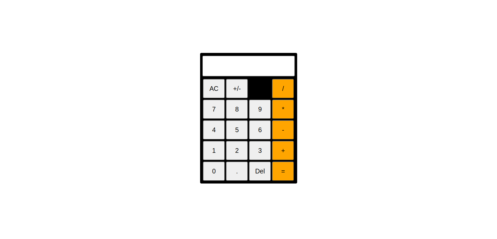

# odin-calculator

## Links 
- [Live preview](https://azanra.github.io/odin-calculator/)
- [Assignment page](https://www.theodinproject.com/lessons/foundations-calculator#introduction)

# About

This project contain a simple calculator, User will able to
do basic math operation like addition, substraction, Multip
lication, and division. The project focus on manipulating 
data from the DOM, store it, do operation based of the 
operator that user chose and display the result to the dom

# Screenshot
